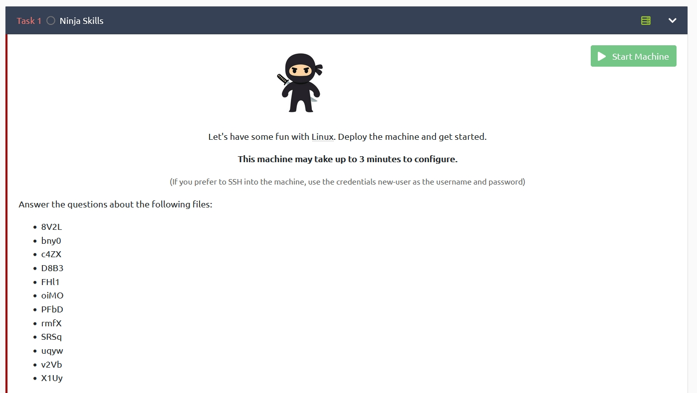
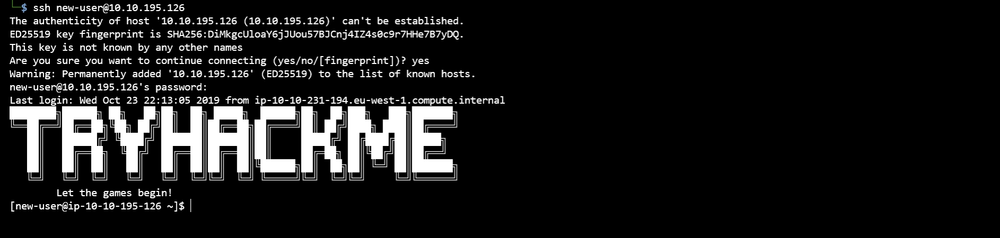
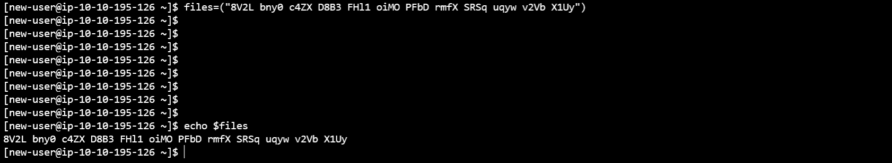
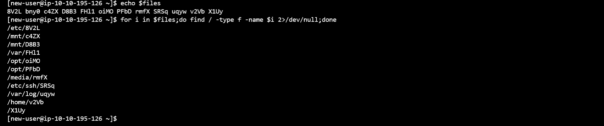
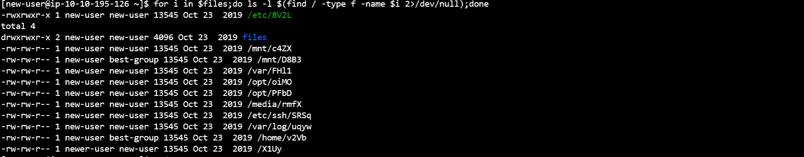
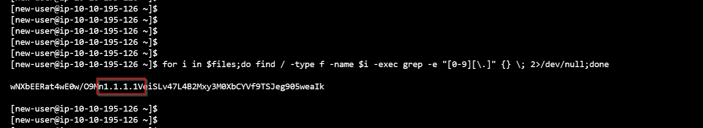
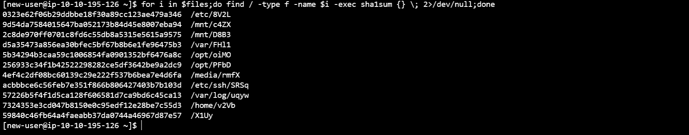
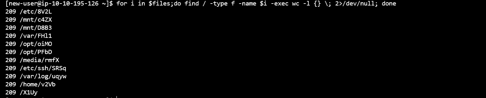
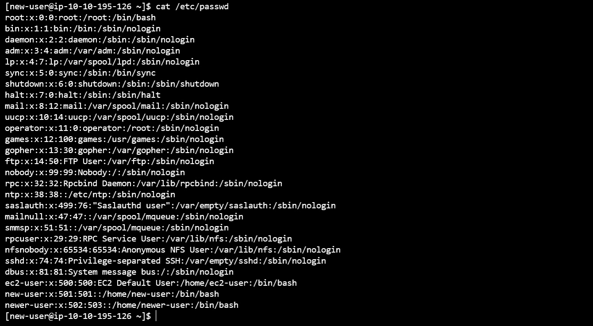
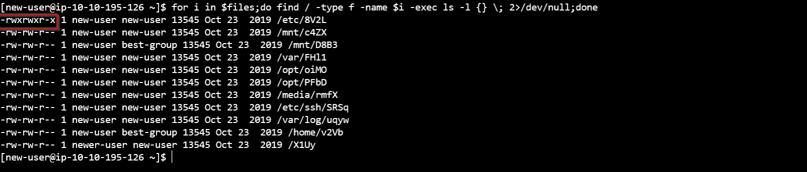

# TryHackMe - Ninja Skills


We will be solving the [Ninja Skills](https://tryhackme.com/room/ninjaskills "tryhackme - NinjaSkills room") room today.

This room is mainly targeting the *find* command in detail. But we gonna take advantage of the room to touch some *bash scriptings* too...

---

We are to look for the following files within the target machine:


    8V2L
    bny0
    c4ZX
    D8B3
    FHl1
    oiMO
    PFbD
    rmfX
    SRSq
    uqyw
    v2Vb
    X1Uy



1. First we gonna ssh into the target machine with the credentials *user:new-user pass:new-user*
```bash
ssh new-user@target-ip
```


2. First we can create an array of the files.
```bash
files=("8V2L bny0 c4ZX D8B3 FHl1 oiMO PFbD rmfX SRSq uqyw v2Vb X1Uy")
```
You can check the created array using:
```bash
echo $files
```


3. Now you can loop through this array and find their locations
```bash
for i in $files;do find / -type f -name $i 2>/dev/null;done
```

*You can see the second file( "bny0" ) is not available in the filesystem*

4. First question:

*Which of the above files are owned by the best-group group(enter the answer separated by spaces in alphabetical order)*

We can find the owners of each file
```bash
for i in $files;do ls -la $(find / -type f -name $i 2>/dev/null);done
```


or

you can use the *-exec* to execute commands within find command
```bash
for i in $files;do find / -type f -name $i -exec ls -l {} \; 2>/dev/null;done
```
here, *-exec* gonna execute the command *ls -l {} ;*

and the curly braces {} gonna capture the output of *find* command.

5. Second question:

*Which of these files contain an IP address?*

First of all we need to create a regex to capture an IP address.

We can simply look for the occurences of a number *[0-9]* and then a dot *[\.]*
```bash
for i in $files;do find / -type f -name $i -exec grep -e "[0-9][\.]" {} \; 2>/dev/null;done
```


or,

We can user Extended regex to grep an exact ip address
```bash
for i in $files;do find / -type f -name $i -exec grep -E "[0-9]{1,3}[\.][0-9]{1,3}[\.][0-9]{1,3}" {} \; 2>/dev/null;done
```
just a little modification to see the file name also which contains the IP address
```bash
for i in $files;do find / -type f -name $i -exec grep -E "[0-9]{1,3}[\.][0-9]{1,3}[\.][0-9]{1,3}" {} \;ls $i \; 2>/dev/null;done
```


6.  Third question:

*Which file has the SHA1 hash of 9d54da7584015647ba052173b84d45e8007eba94*

We need to calculate the *sha1sum* of each file and manually look for the matching hash
```bash
for i in $files;do find / -type f -name $i -exec sha1sum {} \; 2>/dev/null;done
```



7. Fourth question

*Which file contains 230 lines?*

Let's look for the number of lines in each file

```bash
for i in $files;do find / -type f -name $i -exec wc -l {} \; 2>/dev/null; done
```


We can assure that none of the listed files do not have 230 lines. And out of 12 we can find only 11 files in the filesystem. So.. I guess the missing file may be the answer. 

8. Fifth question

*Which file's owner has an ID of 502?*

We have already found the owners of each file. But let's check out another way using the *-exec*. 

```bash
for i in $files;do find / -type f -name $i -exec ls -l {} \; 2>/dev/null;done
```
next you can read the */etc/passwd* file and look for the userId.



9. Sixth question

*Which file is executable by everyone?*

let's check the permissions of all files.

```bash
for i in $files;do find / -type f -name $i -exec ls -l {} \; 2>/dev/null;done
```

We can find only only 1 file have given the executable permission.

10. Summary

Today we explored the following tools

* find
* grep
* exec
* bash scripting

Hope you guys learned something new.


---
### Thank you
---